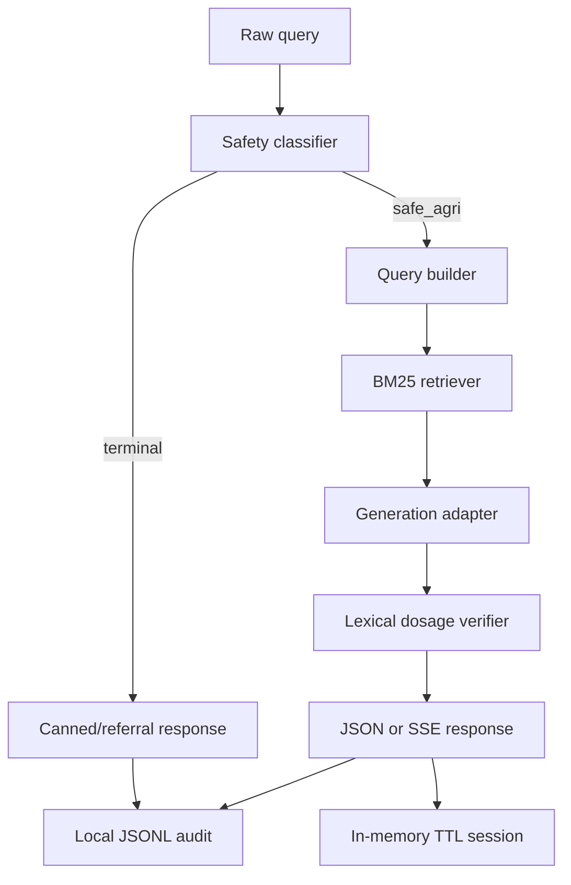
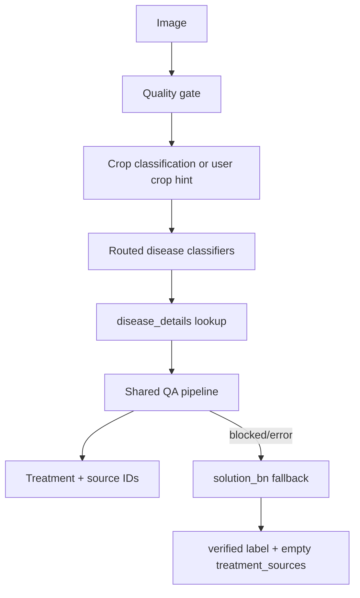
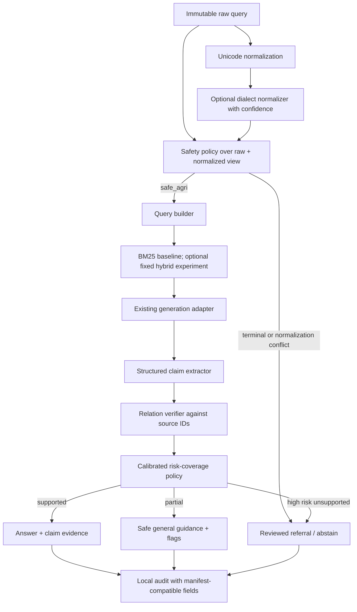

# Recommended Architecture

## Current runtime

Confirmed composition: `backend/app/application/container.py` wires `BM25Retriever` and `DosageVerifier`. Dense or hybrid retrieval is not active there.

## Current vision flow and defect

`BAD` is a software safety defect. Fix it before research evaluation by preserving a stable `vision-details:<model>:<label>` source ID and passing fallback advice through the same verifier policy, or label it `unverified_local_knowledge`.

## Proposed bounded flow

## Module boundaries

| Concern | Proposed seam | Rule |
|---|---|---|
| Structured claims | Domain dataclasses near `backend/app/domain/contracts.py` | No provider imports |
| Verification | Extend `backend/app/ports/verifier.py` | One interface; no second active pipeline |
| Extractor/NLI/LLM adapters | `backend/app/infrastructure/verification/` | Replaceable and testable offline |
| Abstention policy | Application/domain policy | Threshold fitted on dev only; fail closed |
| Normalization | New port plus infrastructure adapter | Audit raw and normalized forms; preserve raw input |
| Retrieval experiment | Existing retriever port | BM25 remains baseline; hybrid activation needs evidence gate |
| Composition | `backend/app/application/container.py` | Only wiring point |
| Transport | Existing JSON/SSE contracts | Additive fields only; routes remain thin |

## KEEP / REFINE / EXTEND / REPLACE / REMOVE

| Decision | Item | Reason |
|---|---|---|
| KEEP | Safety before retrieval; terminal fail-closed policy | Established invariant and selected gap foundation |
| KEEP | Shared JSON/SSE use case, ports, local JSONL audit, TTL sessions | Adequate architecture; not a research contribution |
| KEEP | Classification-only vision claims and quality gate | Matches checked-in artifacts |
| REFINE | Audit schema | Add experiment/run ID, raw/normalized query hashes, claim verdicts, threshold version |
| REFINE | Vision fallback | Preserve evidence IDs; never mark source-empty advice verified |
| EXTEND | Verifier port and domain contracts | Add typed claim relations and risk labels |
| EXTEND | Evaluation harness | Frozen manifests, hashes, seeds, split IDs, paired outputs |
| EXTEND | Optional normalizer port | Evaluate raw vs normalized without hiding raw intent |
| REPLACE | Lexical verifier as sole verifier | Retain it as a baseline; use selected structured/hybrid method in proposed path |
| REPLACE | Placeholder benchmark endpoint, only after artifacts exist | Serve precomputed validated outputs; do not calculate live |
| REMOVE | None from active architecture during research | Avoid destabilizing the demo; retire shims only in a separate refactor |

## Mathematical formulation

Let an answer produce claims `c_i` with structured fields and evidence set `E`. A verifier estimates support labels `y_i` and a calibrated risk score `r_i`. The policy selects an action from `{answer, flag, abstain}` under a coverage constraint. The study will minimize empirical high-risk unsupported-claim loss subject to a prespecified minimum coverage chosen before test evaluation.

Do not finalize an equation until Stage 2 defines: field-level matching rules, partial support, numeric tolerances, risk weights, aggregation from claims to answers, and threshold-selection constraints. Record these decisions before annotation begins.
