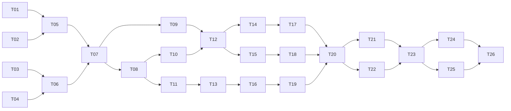

# Agent Task Graph

## Execution rules

Each task goes to one ordinary agent. The agent receives listed inputs, edits only the stated boundary, writes the deliverables, runs the verification command defined during execution, and records blockers. No task requires unstated judgment: ambiguous research labels go to named expert-review tasks.

## Parallel lanes

- **Lane E:** evidence and artifact reconciliation
- **Lane S:** schemas, annotation, and study governance
- **Lane V:** verifier and calibration
- **Lane D:** dialect, retrieval, and safety
- **Lane X:** engineering safety and integration
- **Lane P:** analysis, paper, and release

## Dependency graph

## Tasks

| ID/Lane | Objective | Inputs | Dependencies | Deliverables | Completion criteria | Risks/rollback |
|---|---|---|---|---|---|---|
| T01/E | Extract both authoritative PDFs without adopting claims | Two local PDFs; paper policy | None | Page-addressed extraction, tool/version log, PDF hashes | Every candidate claim links to page text and remains TODO | OCR error; preserve raw extraction |
| T02/E | Locate all dataset artifacts, including nested `dataset_release` candidates | Repository tree, HF references from literature | None | Dataset inventory with paths, schemas, counts, hashes, missing list | Counts computed from files; root absence documented | Large files; use streaming counters |
| T03/E | Inventory RAG indexes, corpora, eval files, and model artifacts | `backend/ml_assets/**` | None | Artifact ledger and compatibility report | Every artifact has path/hash/format/status | Pickle safety; do not load untrusted files |
| T04/X | Snapshot active code behavior and contracts | Active backend, tests, docs | None | Current-flow test/report, code revision | BM25-only, lexical verifier, safety order, SSE parity confirmed | Dirty tree; do not alter existing work |
| T05/E | Reconcile PDF numbers with stable artifacts | T01-T03 outputs | T01,T02 | Claim ledger: verified/conflicted/missing | No numerical paper claim lacks artifact link or TODO | Conflict; report, do not average |
| T06/X | Specify and test vision evidence defect | Vision pipeline/contracts | T03,T04 | Failing fixture, remediation design | Fixture reproduces `verified` plus empty sources | No code change until owner approves |
| T07/S | Freeze research questions, primary endpoints, schemas, and analysis plan | Literature package, T05 | T05,T06 | Protocol v1, claim schema, risk taxonomy | Expert signs schema; primary tests named | Scope drift; version and freeze |
| T08/S | Write annotation manual and pilot set | T07 protocol, source passages | T07 | Guidelines, pilot items, adjudication form | All fields and edge cases have examples | Unsafe content handling; restrict access |
| T09/P | Build experiment manifest and split specification | T07 | T07 | Machine-readable schema, split rules, hash procedure | Synthetic dry run reconstructs one run | Tool version drift; pin lock/hash |
| T10/S | Run independent expert pilot and agreement analysis | T08 | T08 | Raw labels, agreement report, disagreements | Prespecified agreement gate evaluated | Low agreement; revise schema once |
| T11/D | Design paired dialect/Banglish intent set | T08, verified dataset inventory | T08 | Lineage-preserving candidate pairs | No split leakage; slots frozen | Synthetic dialect artifacts |
| T12/V | Implement offline lexical baseline reproduction | Existing verifier, T09 | T09,T10 | Baseline outputs and manifest | Matches current logic on fixtures | Runtime mismatch; record exact code hash |
| T13/D | Conduct native authenticity and intent review | T11 | T11 | Accepted/rejected pairs, reviewer labels | Agreement and rejection reasons reported | Reviewer scarcity; reduce varieties |
| T14/V | Implement fixed LLM-judge baseline offline | T09, T10 | T12 | Prompt hash, outputs, costs/errors | Deterministic settings and full manifest | Provider drift; cache raw responses |
| T15/V | Implement NLI/structured verifier candidates offline | Frozen schema, T12 | T12 | Candidate outputs and unit tests | All fields emitted; failures explicit | Model unavailable; use feasible candidate only |
| T16/D | Build raw and normalization retrieval/safety harness | T09,T13, current ports | T13 | Condition outputs with raw/normalized audit | Same intent IDs across conditions | Normalization hides intent; fail closed |
| T17/V | Compare verifier baselines and run ablations | T14,T15 | T14,T15 | Metrics, paired tests, error taxonomy | Test split evaluated once under frozen plan | Tuning on test; invalidate and re-freeze |
| T18/V | Fit and freeze calibrated abstention | T17 development outputs | T15,T17 | Calibrator, threshold, reliability plots | Threshold fixed before final test | Sparse high-risk class; simplify policy |
| T19/D | Run dialect retrieval and safety experiments | T16 | T16 | Per-variety metrics, bootstrap/McNemar outputs | Intent preservation and safety flips reported | Small cells; suppress unsupported inference |
| T20/P | Execute final frozen component evaluation | T17-T19 | T17,T18,T19 | Locked metrics bundle and hashes | Independent script regenerates tables | Any post-hoc change creates new version |
| T21/X | Repair vision evidence path and add regressions | T06 design, T20 policy where relevant | T20 | Source-preserving behavior and tests | No source-empty advice marked verified | Integration regression; feature flag/rollback |
| T22/X | Integrate passing verifier/normalizer through ports | T20, architecture contract | T20 | Domain/port/adapter/container changes, tests | Routes unchanged; failures fail closed | Module misses gate; do not integrate |
| T23/S | Run expert end-to-end evaluation | T21,T22 outputs | T21,T22 | Blinded ratings and agreement | Prespecified analysis complete | Expert availability; reduce secondary endpoints |
| T24/S | Run conditional farmer study | Ethics approval, T23-safe stimuli | T23 | Consent records, deidentified data, report | Ethics and stop conditions satisfied | No approval; cancel without blocking paper |
| T25/P | Draft paper, figures, tables, limitations | T20,T23 | T23 | Full manuscript blueprint population | Every claim links to evidence ledger | Space pressure; remove secondary claims |
| T26/P | Independent reproduction and release audit | T24 optional, T25 | T24,T25 | Reproduction report, artifact index, final checklist | Fresh environment reproduces primary tables | Missing dependency/data; block release |

## Scheduling notes

T01-T04 run in parallel. After T07, annotation, manifests, and engineering defect specification split into parallel work. Verifier work and dialect work remain independent until T20. T24 is optional and must never block T26 when ethics or recruitment is unavailable; mark it cancelled with reason and proceed with expert-only claims.
