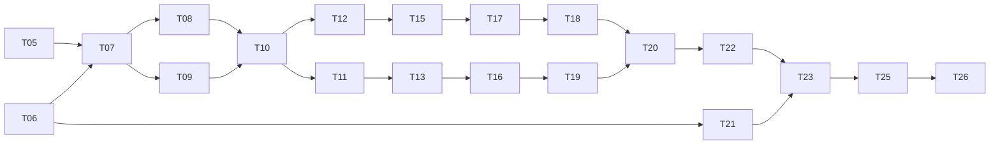

# Final Implementation Specification

## Execution Objective

Implement and evaluate the adjudicated thesis without further research redesign. Ordinary agents follow the ordered graph below, edit only declared boundaries, and stop at failed gates. T05, T06, and T07 run first. The default plan never requires a learned normalizer.

## Exact Likely Boundaries

Research artifacts should live under a new `research_artifacts/` tree defined in `../06_EVALUATION_BENCHMARK_PLAN.md`. Runtime changes, after offline gates pass, are likely limited to:

- `backend/app/domain/contracts.py`
- `backend/app/domain/enums.py`
- `backend/app/ports/verifier.py`
- `backend/app/application/qa_pipeline.py`
- `backend/app/application/container.py`
- `backend/app/application/vision_pipeline.py`
- `backend/app/infrastructure/verification/dosage.py` as the preserved baseline
- new files under `backend/app/infrastructure/verification/`
- `backend/app/models/schemas.py` only for approved additive diagnostics
- `backend/tests/test_pipeline.py`
- `backend/tests/test_vision.py`
- new offline scripts under `scripts/` or a dedicated research harness, never route code

Agents must inspect the active tree before editing; these are likely files, not permission to overwrite concurrent work. Legacy `backend/app/agents/` and `services/advisory/` remain shims.

## Amended Task Graph

T14 fixed LLM-judge and optional NLI work may run after T12 as secondary comparison work. T24 farmer study is removed from the minimum thesis. E8/E9 remain optional.

## Phases and Tasks

| Phase/task | Inputs | Exact outputs | Likely files | Required tests/evidence | Stop/go gate |
|---|---|---|---|---|---|
| **P0 T05: Reconcile claims** | T01 extraction; T02/T03 inventory; authoritative local filenames; paper policy | Versioned numerical claim ledger with `verified/conflicted/missing/NEEDS RECONCILIATION`, artifact path, hash, count method | New files only under `research_artifacts/reports/data_audit/` | Independent recount for each retained number; no PDF-only number promoted | **STOP** if a primary dataset/sample claim lacks stable artifact evidence. **GO** with TODO for non-primary numbers. |
| **P0 T06: Specify vision defect** | T04 behavior; active vision pipeline/tests | Failing fixtures for both source-empty `verified` fallback branches; remediation contract | First produce evidence/spec artifacts; failing tests later in `backend/tests/test_vision.py` when implementation starts | Fixture proves `verified` plus empty sources at captured revision | **STOP** integrated safety claims until reproduced. **GO** to protocol work once defect is specified. |
| **P0 T07: Freeze protocol** | T05/T06; this adjudication package; verified literature metadata | Protocol v1, schema JSON Schema, label manual outline, risk taxonomy, endpoints, margins, multiplicity plan, latency budget, sample gates | `research_artifacts/annotations/guidelines/`, `research_artifacts/datasets/frozen/`, `research_artifacts/manifests/` | Expert sign-off; schema round-trip; forbidden test access policy | **STOP** if stable evidence spans or expert support are unavailable. **GO** only after signed version freeze. |
| **P1 T08: Annotation pilot** | Frozen schema; sampled source passages and answers | Pilot items, two independent label sets, adjudication forms, revised guidelines version | `research_artifacts/annotations/{pilot,adjudicated}/` | Validate every relation, missing-value state, conflict, and safety criterion | **STOP** after at most one guideline revision if agreement gate fails. |
| **P1 T09: Manifests/splits** | T07 protocol; artifact hashes | Machine-readable run manifest, grouped split IDs, leakage report, hash tool | `research_artifacts/manifests/`; frozen split files | Dry-run reconstruction; source/intent/transformation grouping tests; near-duplicate report | **STOP** on leakage or irreproducible inputs. |
| **P1 T10: Expert gold** | T08/T09 | Independent labels, agreement statistics, adjudicated frozen train/dev/test, raw audit | `research_artifacts/annotations/adjudicated/`; `datasets/frozen/`; agreement report | Krippendorff alpha or approved kappa; span/field/relation agreement; adjudication rate | **STOP** primary study if agreement misses gate after allowed revision. |
| **P2 T12: Lexical baseline** | Captured verifier revision; frozen data | Offline predictions matching current logic, unit tests, manifest | Reuse/import `backend/app/infrastructure/verification/dosage.py`; new research runner | Bengali digit/unit fixtures; parity against captured tests; full failure log | **GO** only if fixture parity passes. Do not silently improve the baseline. |
| **P2 T15: Structured verifier** | T07 schema; T10 gold; T12 runner | Deterministic parser/normalizer, relation matcher, traces, oracle-field mode; optional NLI adapter separate | New `backend/app/infrastructure/verification/{claim_parser.py,normalization.py,relation_matcher.py,structured.py}` or equivalent minimal names; research runner | Unit/dimension, denominator, interval, PHI, polarity, applicability, conflict, missing evidence, Bengali numeral tests | **STOP** if hard failures certify; **GO** offline if all fail-closed tests pass. |
| **P2 T17: Verifier evaluation** | T12/T15 frozen predictions | E1/E3 metrics, paired tests, error taxonomy, latency | `research_artifacts/runs/` and reports | One test execution; McNemar/bootstrap; oracle extraction decomposition; ablations | **STOP** superiority claim if E1 fails. A descriptive resource paper remains possible only by explicit amendment. |
| **P3 T18: Calibration** | Development outputs from selected structured candidate | Frozen calibrator, threshold, risk-coverage curves, test bundle | Research-only calibration module and serialized artifact under frozen data/manifests | Dev-only selection; threshold lock hash; E2 test; sensitivity report | **STOP** runtime integration if risk/coverage or stability gate fails. |
| **P3 T11/T13: Dialect pair construction and review** | Verified datasets; T08 manual; native reviewers | Paired intent set, frozen slots, accepted/rejected variants, dictionary source records | `research_artifacts/datasets/{raw,interim,frozen}/`; annotation audit | Native intent/authenticity agreement; lineage and leakage checks | **STOP** subgroup inference below sample gate; reduce scope rather than fabricate variants. |
| **P3 T16: Normalization harness** | T13 pairs; current safety/retriever ports; reviewed dictionary | Raw, Unicode, dictionary outputs with edit traces, safety before/after, rankings, verifier links | Offline harness; reviewed dictionary artifact. No runtime wiring yet | Slot/polarity preservation, unknown-term no-op, low-confidence raw fallback, same-BM25 assertion | **STOP** learned work by default. Consider it only after dictionary dev gap and all gates. |
| **P3 T19: Dialect robustness** | T16 outputs | E4/E6 paired metrics, safety flips, subgroup report | Research runs/reports | Grouped bootstrap, paired exact tests, native review missingness | **STOP** normalization claim if safety margin fails. Retrieval-only descriptive result may remain. |
| **P4 T20: A/B interaction and freeze** | E1/E2/E4 results | E5 factorial interaction, final component tables, hashes | Final frozen run bundle | Clustered paired bootstrap by intent; one locked table-generation script | **STOP** combined thesis wording if interaction fails; retain A-only wording by dated amendment. |
| **P4 T21: Vision repair** | T06 fixtures; verifier policy | Source-linked same-pipeline fallback or explicit uncertified outcome | `backend/app/application/vision_pipeline.py`; domain/schema only if needed; `backend/tests/test_vision.py` | Blocked advisory, no advisory, missing source, verifier error, classification-only regression | **STOP** integration if any source-empty advice is `verified`. |
| **P4 T22: Runtime integration** | Passing verifier/calibrator; architecture contract | One verifier adapter wired through existing port; additive audit fields; optional dictionary only if E4/E5 pass | Domain/port/adapter/container/QA boundaries listed above | Full backend suite; JSON/SSE parity; terminal safety; exactly-one audit; latency; rollback config | **STOP** if routes diverge, BM25 changes, or failures do not abstain. |
| **P5 T23: Expert end-to-end evaluation** | Integrated frozen candidate and baseline | Blinded expert labels, agreement, system-level dangerous pass-through and false abstention | Research artifacts only | Prespecified paired analysis and error review | **STOP** end-to-end claim if integrated system violates primary safety gate. |
| **P5 T25: Paper assembly** | T05-T23 evidence | Tables, figures, limitations, contribution evidence links, claim ledger update | New manuscript outputs only; authoritative local papers referenced by filename/path | Every sentence-level empirical claim links to run/artifact; PDF numbers reconciled or omitted | **STOP** unsupported wording. No post-hoc hypothesis rewrite. |
| **P5 T26: Release audit** | Frozen data, code, manifests, manuscript | Independent reproduction report, checksums, artifact index, redaction/license review | Release package and reports | Fresh environment regenerates primary tables; raw audit retained; secrets absent | **BLOCK RELEASE** on failed reproduction or missing provenance. |

## Optional Secondary Tasks

- **T14 fixed LLM judge:** run offline with fixed prompt/model/version, cached raw responses, cost/error log, and no gold authority.
- **E8 NLI:** compare only after deterministic verifier passes. Keep offline unless it clears accuracy, safety, latency, and reproducibility gates.
- **E9 learned normalization:** do not begin unless dictionary normalization misses the frozen development target. It must pass every gate in `07_ABSTENTION_AND_DIALECT_PROTOCOL.md` before test access.

## Ordinary-Agent Completion Record

Each task writes: owner, start/end UTC, input hashes, output hashes, code revision, dirty-tree flag, exact commands, tests, failures, unresolved decisions, and gate result. Agents cannot mark their own expert labels accepted or redesign endpoints after freeze.

## No-Redesign Rule

The schema, relation set, primary hypotheses, experiment IDs, BM25 constraint, and contribution contract are frozen here. Implementation agents may resolve code-level details with the smallest compatible change. Any research-level change requires a dated amendment in `MEMORY.md`, rationale, affected runs, and re-freeze decision.
